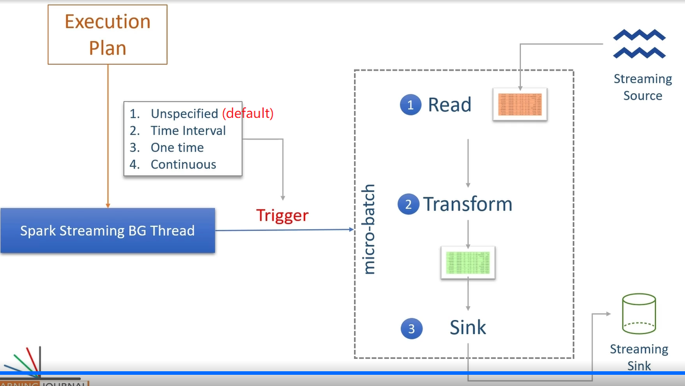

# spark-streaming-tutorial

## Theory

### Data Sources 

Built-in data sources:

- Socket source: not for production, only for learning purpose.
- Rate source: for testing and benchmarking Spark cluster. A dummy data source which generates a configurable number of key/value pairs per second.
- File source
- Kafka source

### Output Modes

- Append: insert only (not supported for aggregation operations, exception)
- Update: upsert
- Complete: overwrite

---

## Development Environment

- OS: Windows 11
- Java: 1.11
- Scala: 2.12.17
- Spark: 3.3.1
- Hadoop: 3.3.1
- IDE: Intellij IDEA Community

---

## Coding

### Word Count with Socket Connection

Use netcat to listen to a port, and wait for input from command line. After inputting some words in command line, they will be counted in real time, and the result will be printed out in console in Intellij IDEA.

Steps: 

1. Download nmap from https://nmap.org/download#windows, and install. 
2. Open terminal, and type `ncat -lk 9999`. (9999 is a random port number here.)
3. In Intellij IDEA, execute class `SocketWordCount.scala`.
4. In terminal, type random words. 
5. Result should be seen in console of Intellij IDEA.
6. Every time before executing this application, it is needed to delete checkpoint folder.

### Flatten Json Files

1. In Intellij IDEA, execute class `JsonFileFlatten.scala`. 
2. Copy one sample json file from folder "sampleData" and paste under folder "input" (create it if there is no such folder).
3. After around 1 min, processed output json file can be seen under folder "output".
4. Repeat step 2 for another json file. 
5. After around 1 min, another processed output json file can be seen under folder "output".
6. Every time before executing this application, it is needed to delete checkpoint folder.

---

## Troubleshooting

Problem 1:

When executing Spark streaming job, encountered the error: `Exception in thread "main" java.lang.UnsatisfiedLinkError: org.apache.hadoop.io.nativeio.NativeIO$Windows.access0(Ljava/lang/String;I)Z`.

Solution: 

Apart from the file "winutils.exe", also need to put the file "hadoop.dll" under folder "hadoop-3.3.1\bin".
